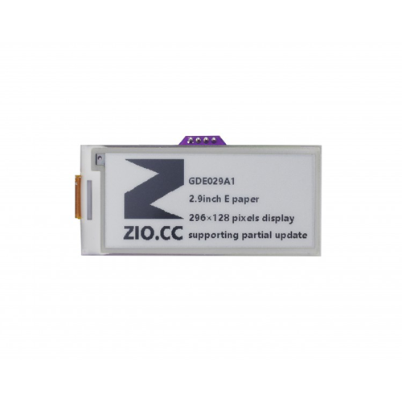
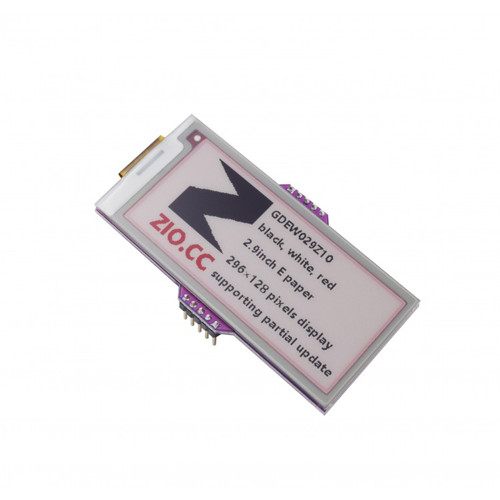

# Zio Qwiic E-Ink Display 2.9"

> This product can be available for purchase [here](https://www.smart-prototyping.com/%20Zio-Qwiic-E-ink-Display-I2C).

##### Description

An E-ink module is great, how about to make it even nicer? Here we go! Instead of using SPI protocol, we created this I2C E-ink display to join our Qwiic family. So you can just daisy chain this E-ink display just like the other Qwiic modules!

Nothing fancy here, we add a STM32 as the gateway, it can communicate with I2C system, then drive E-ink display to refresh content by SPI protocol.

In order to inherit the ultra low power consuming feature of the E-ink display, we let the STM32 IC go into deep sleep mode (2uA power consuming) and add an I2C chip that is used for waking STM32 up.

> This product can be available for purchase [here](https://www.smart-prototyping.com/Zio-E-Ink-Display-2-9-in-Black-White-Red).

Tired of using boring black and white E-ink display? Let’s add a spicy color to it! This is a 2.9 inch Red-Black-white E-ink display with 296x128 pixels resolution.

The red is good, but not always, because of the limitation of the E-ink display technology, the refresh time for Red E-ink display is much longer than Black-White version, this E-ink display refresh time is 12 secs! Let’s hope the technology will solve this soon, until then, enjoy this red E-ink first!

##### Usage:

* Price tag for supermarket, shop
* Industry controller device
* Low power Consumption product and project

###### About Zio
> Zio is a new line of open sourced, compact, and grid layout boards, fully integrated for Arduino and Qwiic ecosystem. Designed ideally for wearables, robotics, small-space limitations or other on the go projects. Check out other awesome Zio products [here](https://www.smart-prototyping.com/Zio).
